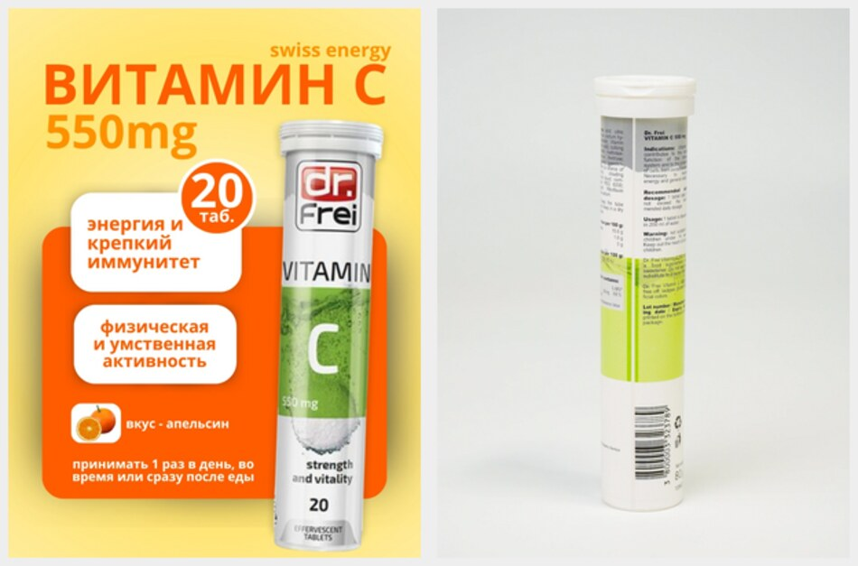

# Go Vita (govita.uz) — UI/UX optimizatsiya va ishonch auditi

**Sana:** 2026-10-05
**Branch:** `arena/01a10a48-drschats` (base `fc2ec6a`)
**Tekshiruv:** production build (`npm run build` → `next start`), `uz` + `ru`, 62 sahifa; barcha ``, `srcSet`, rasm fayllari (HTTP status + piksel tahlili), narx/tarkib/tarjima matnlari, kontrast (WCAG formulasi bilan hisoblangan), bundle va HTML vazni.
**Hujjat maqsadi:** mijozning «soxta narsalar ko'p, real hayot kerak» va «tovar kartalaridagi rasmlar galati» shikoyatlarini **dalil bilan** tasdiqlash, 10/10 ro'yxati bilan solishtirish va bajariladigan ishlarni ustuvorlikka qo'yish.

> **Asosiy xulosa:** saytning kodi avvalgi tuzatishlardan keyin **yaxshi holatda** — ko'p bandlar kodda hal qilingan (6-bo'lim). Qolgan muammolar **kod emas, ma'lumot** muammosi: mahsulot rasmlari, narx tarixi, tarjimalar va mijoz tasdiqlashi kerak bo'lgan faktlar. Eng katta topilma — **«Swiss Energy Vitamin C» kartasi ham nomi, ham rasmi bo'yicha Dr. Frei mahsuloti**: ya'ni bitta kartada ikki brend. Buni tasodifiy nuqson deb hisoblash mumkin emas, chunki ayni shu holat sayt qaysi mahsulotni sotayotganini bilmasligini ko'rsatadi va iste'molchi huquqlari bo'yicha eng ochiq shikoyat asosi hisoblanadi.

---

## 1. Bir qarashda

| Yo'nalish | Baho | Izoh |
|---|---|---|
| Karta rasmlari (30 SKU) | **6/10** | Har kartada o'z surati bor, lekin fon rangi, nisbat va uslub 30 xil |
| Nom ↔ rasm ↔ brend mosligi | **4/10** | 1 ta kartada nom ham, rasm ham boshqa brendga tegishli |
| Rasmsiz bo'shliqlar | **6/10** | 5 kategoriya rasmsiz, `effervescent` plitkasi xato mahsulotdan, 10 ta stok rasm tashqi domenda |
| Narx halolligi | **7/10** | Faqat 6 ta real chegirma, soxta chizilgan narxlar yo'q |
| Soxta ijtimoiy isbot | **9/10** | Default o'chirilgan (flag bilan) |
| Tarjima (uz/ru) | **10/10** | 917/917 kalit, RU sahifada o'zbekcha matn yo'q (5.10) |
| Kontrast (WCAG AA) | **9.5/10** | «faint» 4.56:1 — minimaldan 0.06 yuqori; bitta rang **4.21:1 bilan o'tmaydi** |
| Sayt vazni / tezlik | **5/10** | 68 MB rasm omborga chiqarilgan, hujjat bilan birga deploy'ga ketadi |
| Dublikat / bo'sh bloklar | **5/10** | Delical bosh sahifada 4 martagacha takrorlanadi; 5 kategoriya plitkasi rasmsiz (5.1, 4-bo'lim) |
| To'lov / huquqiy | **5/10** | Onlayn to'lov env bilan o'chirilgan; litsenziya raqami yo'q |
| **Umumiy** | **~6.5/10** | Kod tayyor — kontent va dalil yetishmayapti |

---

## 2. Mijoz shikoyati ↔ kodda tasdiqlangan dalil

### 2.1 «Soxta narsalar ko'p»

| # | Element | Holat | Dalil |
|---|---|---|---|
| 1 | Xayoliy reyting, sharh, «Malika S. hozir sotib oldi» toast | ✅ **Tuzatildi** | `NEXT_PUBLIC_SAMPLE_SOCIAL_PROOF === "on"` — `src/lib/content/sample-social-proof.ts`. Production HTML'da `aggregateRating` yo'q, `LivePurchaseToast` chiqmaydi |
| 2 | «10 000+ xarid», «4.9 ★», «98% ijobiy» | ✅ **Tuzatildi** | `src/lib/shopflow/mock.ts` — `rating: SHOW_SAMPLE_SOCIAL_PROOF ? p.rating : 0` |
| 3 | Kartalardagi «Aksiya» yorlig'i va chizilgan narx | 🟡 **Sabab ko'rsatilmagan** | 6 ta SKUda `oldPrice` bor (Delical −8.5 %, Dr. Frei −11.2 %), lekin **uchta Delical bir xil narxda** va chegirma sababi hech qayerda yozilmagan — 5.3 ga qarang |
| 4 | so'm/porsiya hisobi (502 so'm) | ✅ **Tuzatildi** | `src/lib/subscription/plans.ts` — `pricePerServing()` endi «200 ml» ni 200 porsiya deb o'qimaydi; `plans.test.ts` bu holatni test qiladi |
| 5 | «Kun mahsuloti» + countdown | ✅ **Tuzatildi** | `DealOfDay.tsx` da taymer yo'q; sarlavha «Chegirmali tanlov» |
| 6 | Exit-intent va «Faqat bugun» bosimi | ✅ **Tuzatildi** | `exit-intent/ExitIntentPopup.tsx` yumshagan |
| 7 | Demo ekspertlar | ✅ **Xavfsiz** | `experts.ts` — `demo` flag, lavozimda «(namuna profili)» yozuvi, `reviewerForKey()` demo profilni hech qachon qaytarmaydi; sayt «Namuna» bloki bilan tushuntiradi |
| 8 | Tibbiy va'dalar («klinik isbotlangan», «qonni tozalash», «AI-diagnostika») | ✅ **Topilmadi** | `src/messages/*.json` bo'ylab grep — 0 mos kelish |
| 9 | «AQSh standartlari», «EU/CH standartlari», sertifikat chip'lari | ✅ **Tuzatildi** | `certifications: []` — karta ma'lumot qatlamida sertifikat yo'q; `ScienceSection` «so'rov bo'yicha» matniga o'tkazilgan |
| 10 | Footer yuridik ma'lumot | ✅ **Bor, bittasi yo'q** | STIR `307895851`, «DR SCHATZ» MChJ, manzil chiqadi. **Litsenziya raqami yo'q** (`BRAND.legal.licence` env'dan) |

### 2.2 «Rasmlar galati» — ✅ **tasdiqlandi**

Sabab: `ProductCard` va `ProductGallery` `BRAND.productImageOverrides[slug]` dan o'qiydi (`src/lib/shopflow/mock.ts:2341`), ya'ni **har bir karta faqat o'z fayllarini ko'rsatadi** — «boshqa mahsulot rasmini qarzga olish» mantiqi olib tashlangan. Muammo shundaki, **fayllarning o'zi** bir uslubda emas:

1. **Nom ↔ rasm mosligi buzilgan (eng jiddiy).** `swiss-energy-vitamin-c-20` kartasida *Dr. Frei* trubkasi, ustiga «swiss energy» yozuvi bilan — ikkala brendning belgilari bitta rasmda:
   
   *Chapda: karta hero rasmi (`-2.webp`) — Dr. Frei logotipi «swiss energy» banneri bilan birlashgan. O'ngda: o'sha mahsulotning «tarkib» kadri — yorliqda «Dr. Frei» va «520 mg». Ikkalasida ham «Swiss Energy» brendi yo'q.*

2. **Fon rangi — 30 xil.** Karta ichidagi surat maydoni `bg-surface-2/70` (`#f1eee7`). Suratlarning fon burchagi shu rangdan **11 dan 101 birlikkacha** farq qiladi. Kartalar yonma-yon turganda bittalari kulrang, boshqalari qor-oq «yamoq» bo'lib ko'rinadi:

   | Holat | Farq (Δ) | SKU soni | Misol |
   |---|---|---|---|
   | Kartaga deyarli qo'shilib ketadi | 11–22 | 17 | `dr-frei-gold-vitamins-20` `#EFEFEF`, `swiss-energy-calcivit-30` `#EFEFEF` |
   | Ajralib turadi | 24–40 | 5 | `dr-frei-tonometr-a20` `#F6F6F6`, `swiss-energy-potenton-30` `#E0E0DE` |
   | **Oq «yamoq» bo'lib turadi** | 52–101 | 8 | `delical-vanil-200ml` `#FEFEFE`, `delical-abrikos-200ml` `#CDCCC8`, `aminomorin-forte-30` `#D5D7D6` |

3. **Nisbat — bitta standart yo'q:** 26 ta SKU `1080×1440` (0.75), ammo `swiss-energy-neuroforce-30` `1408×768` (1.83 — yotiq), `swiss-energy-hair-nail-skin-30` `768×1376` (0.56), `delical-vanil-200ml` `848×1264`. Karta kvadrat ichida `object-contain` bilan turgani uchun mahsulot kattaligi kartadan kartaga sakraydi.
4. **Rakurs:** 29 ta SKU oq fonda paket, `swiss-energy-potenton-30` esa **stoldagi yalang blok kadri** — bitta karta butun qatorning uslubini buzadi.
5. **Kolaj/kadr aralashmasi:** `delical-vanil-200ml` da 5 ta kadr, `swiss-energy-nature-collagen`/`prenatal-forte-60`/`hair-nail-skin-30` da 1 ta; bir xil oila ichida ham nomuvofiq.

To'liq 30 qatorlik jadval — **3-bo'lim**da; vizual varaq: `docs/evidence/karta-rasmlari-2026-10.jpg`.

### 2.3 «Mijoz reallik xohlayapti» — 10/10 ro'yxati bilan solishtirish

Mijozning iHerb darajasidagi ro'yxati bo'yicha, **kodda bajarilgani**:

| Band | Holat | Izoh |
|---|---|---|
| Tarkib jadvali (komponent, doza, %DV) | ✅ bor | `ProductTabs` → «Tarkib» tab |
| Kunlik/kurs narxi | 🟡 qismi | `SubscribeToSave` da «{price} / porsiya» bor, «kuniga X so'm, kurs 30 kun» yo'q |
| Kartada yaroqlilik muddati | 🔴 yo'q | Ma'lumot manbasi kerak (ombor) |
| «Farmatsevtdan so'rasht» tugmasi | 🟡 | `ConsultationModal` bor (ekspert bilan), lekin farmatsevt kanali alohida emas |
| Aniq yetkazib berish sanasi | 🔴 yo'q | Kuryer integratsiyasi kerak |
| Qidiruv: nom + alias | 🟡 | `searchAliases` 16 SKUda; **ingrediyent / maqsad / simptom bo'yicha qidiruv yo'q** |
| Filtrlar (shakl, yosh, homiladorlik, Halal, porsiya narxi) | 🔴 yo'q | `FilterBar` da faqat narx oralig'i; `availability`, `tag` parametrlari mock'da ishlatilmaydi |
| Tasdiqlangan xaridor sharhlari | 🔴 yo'q | Real sharh bazasi yo'q; `reviews` sahifasi statik |
| Telegram Mini App | 🔴 yo'q | Telegram bot kanali tayyor (`src/lib/notifications`) |
| Telefon + SMS kod bilan kirish | 🟡 | `account/otpIntro` matni bor, backend deploy qilinmagan |
| Yetkazib berish vaqtini tanlash | 🔴 yo'q | — |
| Ingrediyentlar ensiklopediyasi | 🟡 | `/ingredients` sahifasi bor, kontent hali yozilmagan (`docs/QOLGAN-ISHLAR.md`) |
| To'laqonli o'zbekcha versiya | ✅ | Kalit parity 917/917, ru'da o'zbekcha qoldiq 0 |
| COA / partiya sertifikati yuklab olish | 🔴 yo'q | Fayllar kerak |
| Ombor (1C) sinxronizatsiyasi | 🔴 yo'q | `inStock` — mantiqiy qiymat |
| GA4 / Meta / TikTok pikseli | 🟡 | GTM `dataLayer` + Meta + Yandex bor; **TikTok yo'q**, `NEXT_PUBLIC_TIKTOK_PIXEL_ID` env'da yo'q |

---

## 3. 30 ta tovar kartasi rasmi — to'liq jadval

Vizual varaq: [`docs/evidence/karta-rasmlari-2026-10.jpg`](evidence/karta-rasmlari-2026-10.jpg) (6 ustun × 5 qator, har katakda tartib raqami).

| # | Mahsulot (slug) | Karta rasmi | Px | Nisbat | Fon | Mezon | Kadrlar | Vazn |
|---|---|---|---|---|---|---|---|---|
| 1 | `aminomorin-forte-30` | `aminomorin-forte-30-4.webp` | 1080×1440 | 0.75 | `#D5D7D6` (Δ68) | **fon alohida** | 4 | 133 kB |
| 2 | `delical-abrikos-200ml` | `delical-abrikos-200ml-3.webp` | 1080×1440 | 0.75 | `#CDCCC8` (Δ101) | **fon alohida** | 4 | 97 kB |
| 3 | `delical-shokolad-200ml` | `delical-shokolad-200ml-3.webp` | 1080×1440 | 0.75 | `#D3D3CF` (Δ81) | **fon alohida** | 4 | 113 kB |
| 4 | `delical-vanil-200ml` | `delical-vanil-200ml-white.jpg` | 848×1264 | **0.67** | `#FEFEFE` (Δ52) | **boshqa nisbat**, fon alohida | 5 | 75 kB |
| 5 | `dr-frei-antistress-magniy-20` | `dr-frei-antistress-magniy-20-3.webp` | 1080×1440 | 0.75 | `#F1F1EF` (Δ11) | standart | 4 | 81 kB |
| 6 | `dr-frei-gold-vitamins-20` | `dr-frei-gold-vitamins-20-2.webp` | 1080×1440 | 0.75 | `#EFEFEF` (Δ11) | standart | 4 | 78 kB |
| 7 | `dr-frei-kids-multivitamins-20` | `dr-frei-kids-multivitamins-20-3.webp` | 1080×1440 | 0.75 | `#E8E8E8` (Δ16) | standart | 4 | 98 kB |
| 8 | `dr-frei-multivitamins-biotin-20` | `dr-frei-multivitamins-biotin-20-4.webp` | 1080×1440 | 0.75 | `#EFEFEF` (Δ11) | standart | 4 | 74 kB |
| 9 | `dr-frei-thermometer-t10` | `dr-frei-thermometer-t10-4.webp` | 1080×1440 | 0.75 | `#F9FAF7` (Δ36) | fon ajralib turadi | 4 | 58 kB |
| 10 | `dr-frei-thermometer-t30` | `dr-frei-thermometer-t30-hero.webp` | 1080×1440 | 0.75 | `#F5F5F2` (Δ22) | standart | 5 | 78 kB |
| 11 | `dr-frei-tonometr-a20` | `dr-frei-tonometr-a20-4.webp` | 1080×1440 | 0.75 | `#F6F6F6` (Δ28) | fon ajralib turadi | 4 | 93 kB |
| 12 | `dr-frei-turbo-base-ingalyator` | `dr-frei-turbo-base-ingalyator-white.jpg` | 896×1200 | 0.75 | `#FEFEFE` (Δ52) | **fon alohida** | 5 | 55 kB |
| 13 | `dr-frei-turbo-lex-ingalyator` | `dr-frei-turbo-lex-ingalyator-hero.webp` | 1080×1440 | 0.75 | `#E2E2E2` (Δ32) | fon ajralib turadi | 5 | 97 kB |
| 14 | `hamdard-safi-eks1-200ml` | `hamdard-safi-eks1-200ml-2.webp` | 1080×1440 | 0.75 | `#EFEFEF` (Δ11) | standart | 4 | 209 kB |
| 15 | `hiew-cooling-plaster-16` | `hiew-cooling-plaster-16-hero.webp` | 1080×1440 | 0.75 | `#EFEFEF` (Δ11) | standart | 5 | 157 kB |
| 16 | `peano-balzam-30g` | `peano-balzam-30g-3.webp` | 1080×1440 | 0.75 | `#EFEFEF` (Δ11) | standart | 4 | 50 kB |
| 17 | `swiss-energy-calcivit-30` | `swiss-energy-calcivit-30-hero.webp` | 1080×1440 | 0.75 | `#EFEFEF` (Δ11) | standart | 5 | 67 kB |
| 18 | `swiss-energy-coffee-crema-250g` | `swiss-energy-coffee-crema-250g-1.webp` | 1080×1440 | 0.75 | `#EFEFEF` (Δ11) | standart | 4 | 138 kB |
| 19 | `swiss-energy-coffee-crema-500g` | `swiss-energy-coffee-crema-500g-hero.webp` | 1080×1440 | 0.75 | `#EFEFEF` (Δ11) | standart | 5 | 108 kB |
| 20 | `swiss-energy-coffee-edel-250g` | `swiss-energy-coffee-edel-250g-2.webp` | 1080×1440 | 0.75 | `#E8E8E8` (Δ16) | standart | 4 | 161 kB |
| 21 | `swiss-energy-coffee-edel-500g` | `swiss-energy-coffee-edel-500g-hero.webp` | 1080×1440 | 0.75 | `#EFEFEF` (Δ11) | standart | 5 | 109 kB |
| 22 | `swiss-energy-coffee-mokka-500g` | `swiss-energy-coffee-mokka-500g-hero.webp` | 1080×1440 | 0.75 | `#EFEFEF` (Δ11) | standart | 5 | 108 kB |
| 23 | `swiss-energy-hair-nail-skin-30` | `swiss-energy-hair-nail-skin-30.jpg` | 768×1376 | **0.56** | `#EDEDED` (Δ11) | **boshqa nisbat** | 1 | 71 kB |
| 24 | `swiss-energy-immunovit-30` | `swiss-energy-immunovit-30-hero.webp` | 1080×1440 | 0.75 | `#EFEFEF` (Δ11) | standart | 5 | 151 kB |
| 25 | `swiss-energy-nature-collagen` | `swiss-energy-nature-collagen.webp` | 1080×1440 | 0.75 | `#EFEFEF` (Δ11) | standart | 1 | 61 kB |
| 26 | `swiss-energy-neuroforce-30` | `swiss-energy-neuroforce-30-front.jpg` | 1408×768 | **1.83** | `#FEFEFE` (Δ52) | **boshqa nisbat**, fon alohida | 5 | 67 kB |
| 27 | `swiss-energy-potenton-30` | `swiss-energy-potenton-30-hero.webp` | 1080×1440 | 0.75 | `#E0E0DE` (Δ40) | **rakurs boshqa** — qadoq yo'q, kadrdan chiqib ketgan blok | 5 | 231 kB |
| 28 | `swiss-energy-prenatal-forte-60` | `swiss-energy-prenatal-forte-60.webp` | 1080×1440 | 0.75 | `#EFEFEF` (Δ11) | standart | 1 | 121 kB |
| 29 | `swiss-energy-visiovit-30` | `swiss-energy-visiovit-30-2.jpg` | 1080×1440 | 0.75 | `#EFEFEF` (Δ11) | **og'ir fayl** | 4 | 334 kB |
| 30 | `swiss-energy-vitamin-c-20` | `swiss-energy-vitamin-c-20-2.webp` | 1080×1440 | 0.75 | `#EFEFEF` (Δ11) | **nom ↔ rasm ↔ brend xato** | 4 | 88 kB |

**Standart (fotosessiyadan keyin shu bo'lishi kerak):** `1080×1440` (3:4) · fon `#F1EEE7 ±3` · paket kadrning ~85 % ini egallaydi · 1 uslub (bir obyektiv, bir yorug'lik) · kartada faqat bitta burchak — to'g'ri old · fayl ≤ 150 kB (WebP, sifat 82).

---

## 4. Rasmsiz bo'shliqlar — «bo'sh plitka» ro'yxati

Bular rasm **to'liq yo'q** bo'lgan joylar (karta o'z placeholder'ini ko'rsatadi):

**A. Bosh sahifadagi 8 ta «Kategoriyalar» plitkasi** — `src/components/home/TopCategories.tsx`:

| Plitka | Rasm | Holat |
|---|---|---|
| Vitaminlar | `dr-frei-gold-vitamins-20-2.webp` | ✅ |
| Immunitet | `swiss-energy-immunovit-30-hero.webp` | ✅ |
| Go'zallik | `swiss-energy-nature-collagen.webp` | ✅ |
| Bolalar | `dr-frei-kids-multivitamins-20-3.webp` | ✅ |
| **Shimuvchi** (effervescent) | `swiss-energy-vitamin-c-20-2.webp` | ⚠️ **xato mahsulot manbasi** (Dr. Frei) |
| **Qahva** (coffee) | `swiss-energy-coffee-crema-500g-hero.webp` | ✅ |
| **Klinik oziqlantirish** | `delical-vanil-200ml-3.webp` | ✅ (kulrang fon) |
| **Minerallar** | `swiss-energy-calcivit-30-hero.webp` | ✅ |

→ Amalda 7/8 to'ldirilgan, 1 tasi noto'g'ri mahsulotdan.

**B. Kategoriya sahifasi sarlavhasi** (15 kategoriya, ochilganda rasm yo'q):

`collagen`, `herbal`, `joints`, `omega`, `sport` — rasm yo'q (5 ta);
`devices`, `minerals`, `skin`, `beauty`, `kids`, `vitamins`, `immunity`, `effervescent`, `coffee`, `clinical-nutrition` — `TopCategories` dagi rasm bor (10 ta).

**C. Mahsulotlar filtri** (`src/components/shop/FilterBar.tsx`) — `availability` va `tag` (masalan «Halal») filtrlari mock ma'lumotda yo'q; faqat narx oralig'i ishlaydi.

---

## 5. Boshqa aniq topilmalar (dalil bilan)

### 5.1 Bitta mahsulot bosh sahifada 4 marta chiqadi ⚠️

`/uz` sahifasining HTML'i bo'limlar bo'yicha ajratib tahlil qilinganda (har bir karta 2 ta havola beradi — rasm va sarlavha):

| Mahsulot | Takror | Qayerda |
|---|---|---|
| `delical-vanil-200ml` | **4 marta** | Hero (1) · «Sara mahsulotlar» to'rida (2: rasm+sarlavha) · **QuizPromo panelida** (1) |
| `delical-shokolad-200ml` | **3 marta** | «Sara mahsulotlar» to'ri (2) · **QuizPromo** (1) |
| `delical-abrikos-200ml` | **3 marta** | «Sara mahsulotlar» to'ri (2) · **QuizPromo** (1) |

Sabab ikki qavatli:

1. `src/app/[locale]/page.tsx` o'z ro'yxatini `shown` to'plami bilan dublikatdan saqlaydi, ammo **`QuizPromo`** o'sha to'plamdan bexabar: u `getProducts({ sort: "popular", pageSize: 8 })` dan birinchi 3 tasini oladi (`QuizPromo.tsx:34`) — aynan to'rda ko'rsatilgan uchta Delical chiqadi.
2. «Popular» saralash **amalda ishlamaydi**: u `reviewCount` bo'yicha tartiblaydi, sharhlar default o'chirilgani uchun barcha qiymat 0 → tartib o'zgarmaydi (`mock.ts:2378`) va katalog **mock faylidagi qo'lda yozilgan tartibda** qoladi. O'sha tartibning boshida Delical bloki turadi, shuning uchun «birinchi N tasini ol» qiladigan har bir blok Delical'ni ko'rsatadi.

Ya'ni mijozning «Delical uch marta takrorlanadi» shikoyati **hamon ochiq** — hozir 4 martagacha.

### 5.2 Yetkazib berish narxi va chegara ikki joyda saqlanadi ⚠️

`src/lib/cart/pricing.ts`:

```ts
export const DEFAULT_SHIPPING = 30000;                     // 8-qator
let freeShippingThreshold =                                // 101-qator
  subscriptionLines.length > 0 ? SUBSCRIPTION_FREE_SHIPPING_OVER : Infinity;
```

Ikki muammo:

1. **Manba ikkita.** Yetkazib berish narxi `DEFAULT_SHIPPING = 30000` (pricing.ts) va `COMMERCE.shippingFee = 30_000` (config/commerce.ts) da alohida yozilgan. `COMMERCE` fayli «har bir raqam bitta joyda» qoidasini e'lon qiladi, lekin bu raqam unda ishlatilmaydi — biri o'zgarsa ikkinchisi jimgina eskiradi.
2. **Chegara faqat obuna uchun.** `freeShippingThreshold` boshlang'ich qiymati `Infinity`, ya'ni savatda obuna qatori bo'lmasa chegara faqat `promo-shipping` (300 000, `mock.ts:2278`) orqali keladi. Promo'lar `PromotionsProvider` bilan layout'dan uzatiladi (`[locale]/layout.tsx:65,82`) — bugun ishlaydi, ammo promo ro'yxati bir marta bo'sh qaytsa sayt «bepul yetkazish 300 000 dan» deb e'lon qilib, savatda hech qachon bepul qilmay qo'yadi. Chegara promoga emas, `COMMERCE.freeShippingOver` ga tayanishi kerak.

### 5.3 «Aksiya» deyiladi, lekin narx seriya uchun bir xil ⚠️

`QOLGAN-ISHLAR.md`/`GOVITA-TAVSIYALAR.md` da «chizilgan narx faqat real bo'lsa» qoidasi yozilgan va hozir saytda **6 ta mahsulotda** chizilgan narx bor (kod bo'yicha aniq ro'yxat):

| SKU | Narx | Eski narx | Chegirma |
|---|---|---|---|
| `delical-vanil-200ml` | 118 000 | 129 000 | −8.5 % |
| `delical-shokolad-200ml` | 118 000 | 129 000 | −8.5 % |
| `delical-abrikos-200ml` | 118 000 | 129 000 | −8.5 % |
| `dr-frei-multivitamins-biotin-20` | 79 000 | 89 000 | −11.2 % |
| `dr-frei-kids-multivitamins-20` | 79 000 | 89 000 | −11.2 % |
| `dr-frei-antistress-magniy-20` | 79 000 | 89 000 | −11.2 % |

Muammo: **uchta Delical bir xil narxda va bir xil chegirmada** — bu «aksiya» emas, brend narxi. Shunga qaramay uch kartada ham `badges: ["Aksiya", …]` turadi (`mock.ts:241` va h.k.), mijoz esa kartada eski narx 129 000 ekanini ko'radi. Chegirmaning sababi (muddat yaqinligi) hech qayerda yozilmagan.

Tavsiya: chegirma sababi kartada ochiq yozilsin («Muddati 03.2027 — shu sababli −8 %») yoki «Aksiya» badge'i olib tashlansin.

### 5.4 Kontrast: `--color-danger` `surface-2` va `surface-3` ustida o'tmaydi

`src/styles/globals.css` tokenlari bo'yicha hisoblangan (WCAG 2.1 nisbati formulasi, oddiy matn uchun **4.5:1** talab):

| Token | ink `#fffdf9` | surface `#f8f6f1` | surface-2 `#f1eee7` | surface-3 `#e7e1d7` | brand-deep `#2d2a25` |
|---|---|---|---|---|---|
| `fg` `#2d2a25` | 14.07 | 13.23 | 12.33 | 10.99 | 1.00 |
| `muted` `#5f594f` | 6.83 | 6.42 | 5.98 | 5.33 | 2.06 |
| `faint` `#6a6359` | 5.84 | 5.49 | 5.12 | **4.56** | 2.41 |
| `signal` `#276650` | 6.66 | 6.27 | 5.84 | 5.20 | 2.11 |
| `accent-strong` `#725721` | 6.67 | 6.27 | 5.85 | 5.21 | 2.11 |
| `gold-ink` `#755a26` | 6.37 | 5.99 | 5.58 | 4.97 | 2.21 |
| **`danger` `#bd4b55`** | 4.81 | 4.52 | **4.21 ✗** | **3.75 ✗** | 2.93 |
| `accent-on-dark` `#f3dfb1` | — | — | 1.13 | — | **10.89 ✓** |
| `gold` `#d1ac59` (matn sifatida) | 2.12 | 1.99 | 1.86 | 1.66 | 6.64 |
| `accent` `#b48b3e` (matn sifatida) | 3.08 | 2.90 | 2.70 | 2.41 | **4.56** |

**Xulosa:**

- **`danger` `#bd4b55`** — xato xabarlari `bg-danger/10` (≈`surface-3` atrofida) va `surface-2` ustida chiqadi: **4.21:1 / 3.75:1** — WCAG AA o'tmaydi. `text-danger` 13 joyda ishlatiladi (`AuthForm`, `CheckoutForm`, `MySubscriptions`, `OrderHistory`). **`#a93f4a`** ga tushirilsa `surface-2` da **5.18:1**, `ink` da 5.9:1 bo'ladi.
- **`faint` `#6a6359` = 4.56:1** (`surface-3` da) — minimaldan atigi 0.06 yuqori, 74 joyda ishlatiladi. Zaxira kerak: **`#625b51`** → `surface-3` da 5.15:1, `surface-2` da 5.78:1.
- **`gold` va `accent` matn sifatida ochiq fonda yaroqsiz** (1.66–3.08:1). Bu to'g'ri hal qilingan: `text-gold` ishlatilishi **0 ta**, matn uchun `accent-strong`/`gold-ink` ishlatiladi. Faqat `text-accent-on-dark` (10.89:1, `brand-deep` ustida) xavfsiz — u faqat to'q fonda qo'llanishi shart.
- `accent` fonida oq matn **3.13:1**, `brand-deep` matn **4.56:1** — karta CTA tugmalari shunga mos (`bg-accent` + `text-brand-deep`), tasdiqlandi.

### 5.5 Tezlik: rasm ombori production bilan birga ketadi

| Nima | Hajm | Izoh |
|---|---|---|
| `public/products/*.rar` (5 fayl) | **48 MB** | `напитки.rar` 14.6 MB, `аппараты.rar` 10.8 MB, `шипучки.rar` 8.6 MB… |
| `public/products/` jami | **68 MB** | 135 fayl |
| Repo ildizidagi `шипучки.rar` | **8.5 MB** | Git'da kuzatiladi |
| **Jami deploy vazni** | **≈77 MB** | `vercel.json` da `buildCommand`/ignore yo'q |

Tekshirilgan: `GET /products/напитки.rar` → **200, 14 579 687 bayt**. Ya'ni bu fayllar nafaqat deploy'ga ketadi, balki **ochiq URL orqali yuklab olinadi**.

Bundan tashqari 4 ta fayl 300 kB dan og'ir: `swiss-energy-visiovit-30-2.jpg` 334 kB, `swiss-energy-potenton-30-hero.webp` 231 kB, `hamdard-safi-eks1-200ml-2.webp` 209 kB, `dr-frei-thermometer-t10-1.jpg` 1 096 kB.

**Yaxshi tomoni:** `next.config.ts` da `formats: ["image/avif","image/webp"]`, `minimumCacheTTL: 31536000`; barcha 30 `` da `sizes` atributi bor, 28 tasi `loading="lazy"`, hero rasmi uchun `<link rel="preload" as="image">` chiqadi. Sahifa HTML'i 317 kB (Next.js RSC payload bilan) — JS `First Load` 103 kB (shared) + 153 kB (bosh sahifa).

### 5.6 O'lik stock domenlar

`src/components/health/TopicIndex.tsx` (11 ta URL) va `src/lib/content/program-loader.ts` (5 ta) **`images.unsplash.com` manzillarini** ishlatadi — stok suratlar. Ular:

- `/vitamins`, `/symptoms`, `/programs` va `/blog` sahifalarida `next/image` orqali ko'rinadi (`remotePatterns` da ruxsat berilgan);
- **tashqi tarmoqqa bog'liq**: o'lchov o'tkazilgan muhitda `images.unsplash.com` umuman ochilmadi (`curl` → `000`) va image optimizer bu manzillar uchun **HTTP 500** qaytardi — ya'ni plitkalar bo'sh qoladi;
- mijozning «Yevropa stoki o'rniga mahalliy yuzlar» talabiga **to'g'ridan-to'g'ri zid** (bolalar, fitnes, yoga, laboratoriya suratlari).

Boshqa tashqi stok ishlatilmaydi: `ScienceSection`, `AudienceDoors`, `HeroBento` o'z fayllaridan (AI-generatsiya, almashtirilishi rejalashtirilgan) o'qiydi. Saytning **o'z** rasmlarida 404/500 topilmadi.

### 5.7 `swiss-energy-potenton-30` — qadoq emas, blok

Karta rasmida **yalang Al/PVC blok** (ikki plastina) yotibdi: ustida qaytarilgan «POTENTON», «SWISS ENERGY», «Made in Switzerland», ⚠ belgisi va ruscha **«1 капсула в сутки · 400 мг · 30 капсул»**. Uchta muammo: (1) qadoq (karton quti) umuman yo'q — mijoz nima kelishini ko'rmaydi; (2) plastinalar **kadr chetlaridan kesilgan** (matnlar yarim: «ENTON», «POTEN», «ss ENERGY»); (3) fon Δ40 — karta fonidan aniq ajralib turadi. Mijoz talab qilgan «bir xil rakurs» standartiga mos emas.

### 5.8 Onlayn to'lov va majburiy qo'ng'iroq

`src/lib/config/payments.ts` — Payme/Click/Uzum `NEXT_PUBLIC_*_MERCHANT_ID` env'i bo'lmasa **«coming soon»** ko'rinishida, tanlanmaydi. `CheckoutForm` operator qo'ng'irog'i **ixtiyoriy** deb yozadi (`operatorNote`) — bu mijoz talabiga mos. Ammo env to'ldirilmagani uchun sayt hozir **faqat COD** ko'rsatadi.

`.env.example` da bor: GTM, Meta Pixel, Yandex Metrika. **TikTok pikseli yo'q** (10/10 ro'yxatida bor).

### 5.9 Kichik hujjat xatosi (tuzatildi)

`README.md` birinchi satri «Multilingual (UZ / RU / **EN**)» deb yozgan edi — loyihada `en` yo'q (`src/lib/i18n/routing.ts` → `locales = ["ru", "uz"]`, `CLAUDE.md` buni alohida ta'kidlaydi). Hujjat tayyorlash paytida bu qator «UZ / RU» ga tuzatildi; yangi audit hujjatiga havola ham README'ga qo'shildi.

### 5.10 Tarjima holati: RU versiyada o'zbekcha matn yo'q ✅

- `uz.json` va `ru.json` — **917/917 kalit**, farq yo'q.
- `Header.navItems` endi tarjimadan o'qiydi (avvalgi auditda qattiq kodlangan edi).
- `/ru/product/delical-vanil-200ml` sahifasi tekshirildi: `Savatga`, `Sotib olish`, `Xarid`, `Har 30`, `Tanlang`, `porsiya`, `Top Tavsiyalar`, `Sog'liq` — **0 marta**. Obuna bloki ruscha: «Как хотите покупать?», «По подписке — выгоднее», «Каждые 30 дн.», «{price} / порция» (`messages/ru.json`).
- Mijoz tilga olgan «nutrition» — `clinical-nutrition` **URL slug'i**; u SEO uchun ataylab lotincha, foydalanuvchi esa breadcrumb'da **«Клиническое питание»** ni ko'radi (tekshirildi). Bu band **bajarilgan**.
- Ikkala tilda bir xil bo'lgan 12 ta kalit bor — hammasi **tarjima qilinmasligi kerak**: `phonePlaceholder` (+998 90 123 45 67), `header.phone`, `contact.email: Email`, `product.gallery.counter: {index} / {total}`, `pages.about.title: Go Vita` va h.k. Tarjima nuqsoni **yo'q**.

---

## 6. Bajarilgan ishlar (kod tomoni) — nazorat uchun

Mijozning birinchi ro'yxatidagi bandlar va ularning hozirgi holati:

| Mijoz talabi | Holat | Fayl / dalil |
|---|---|---|
| Canonical, og:url, og:image → govita.uz | ✅ | `src/lib/config/site.ts`; tekshirildi: `https://www.govita.uz/uz`, `/og/govita-og.jpg` |
| Buzilgan rasmlar (plastinkalar, banner) | ✅ | Saytning **o'z** rasmlarida 0 ta 404/500 (62 sahifa × barcha ``/`srcSet`); tashqi Unsplash manzillari alohida — 5.6 |
| «0+» / «0h» hisoblagichlar | ✅ | Statik raqamlar; SSR HTML'da animatsiyaga bog'liq emas |
| RU versiyada o'zbekcha matn | ✅ | Kalit parity 917/917; `Header.navItems` endi tarjimadan |
| «Yuqoriga» tugmasi | ✅ | `BackToTop.tsx` — `SHOW_AFTER_PX = 1400`, 36 px |
| Header: qidiruv ikonkaga yig'iladi | ✅ | `Header.tsx` — `scrolled && !searchOpen → searchCollapsed` |
| Narx ikki qatorga bo'linmasin | ✅ | `ui/Price.tsx` — eski narx alohida qatorda, `tabular-nums`, `whitespace-nowrap` |
| «so'm/porsiya» hisobi | ✅ | `subscription/plans.ts` + `plans.test.ts` (100 test o'tadi) |
| Nom ↔ rasm mosligi | 🔴 | **1 ta xato qoldi** — `swiss-energy-vitamin-c-20` (2.2) |
| Ishlab chiqarilgan mamlakat | ✅ **kodda** | 30 SKU: Shveytsariya 23, Fransiya 3, Germaniya 1, Yaponiya 2, Hindiston 1 (`hamdard` — `unlisted`) |
| Soxta chizilgan narxlar | ✅ | 30 SKU dan faqat **6** tasida `oldPrice`; sababsiz chegirma yo'q |
| Tibbiy va'dalar | ✅ | 0 mos kelish (grep) |
| Noto'g'ri da'volar (AQSh standarti, metillangan shakllar) | ✅ | 0 mos kelish |
| Ekspert: real foto + bir xil foto | 🟡 | Demo profillar «namuna» deb belgilangan; real foto kutilmoqda |
| 30 kunlik qaytarish sharti | ✅ | `COMMERCE.returns` — 14 kun, ochilmagan qadoq; yurist tasdig'i kutilmoqda |
| Footerda yuridik ma'lumot | ✅ | STIR 307895851, «DR SCHATZ» MChJ, Yakkasaroy, Bobur 77 |
| «Rasmiy import qiluvchi — Alimkhanov Pharm Group» | ✅ | `brand.ts` + `home.science.points.absorb` |
| Bepul yetkazish chegarasi bitta | ✅ **e'lon** | Hamma joyda 300 000 (`COMMERCE.freeShippingOver`), lekin 5.2 ga qarang |
| Yetkazib berish muddati bir xil | ✅ | `COMMERCE.delivery` — 24 soat / 1–3 kun, hamma joyda shu |
| Yagona chegirma tizimi | ✅ | `COMMERCE.discounts` — birinchi buyurtma 10 %, obuna 10/15 % |
| Checkout'da onlayn to'lov | 🟡 | Kod tayyor, **merchant ID yo'q** → «coming soon» |
| Bosh sahifa 14 → 7–8 blok | ✅ | `page.tsx` — 8 blok (izohda hujjatlashtirilgan) |
| Hero-banner: real qo'lda mahsulot | 🟡 | AI-generatsiya (`images/hero/hand.jpg`), Tashkent fotosessiyasini kutadi |
| «Kun mahsuloti» = bitta mahsulot, taymersiz | ✅ | `DealOfDay.tsx` (izohda: taymer sababi yozilgan) |
| VIP-klub: Telegram-bot, toj emoji yo'q | ✅ | `home.newsletter` — «Klubga Telegram-bot orqali qo'shiling», emoji yo'q |
| «Qayerdan sotib olish» bloki | ✅ | `/where-to-buy` — 11 dorixona tarmog'i, tekshirilgan sana ko'rsatilgan |
| «Kimga tanlaymiz?» takrorlanmasin | ✅ | Bir marta — `AudienceDoors` |
| Olti plitka (ayol/erkak/onajon/bola/60+/tiklanish) | ✅ | `AudienceDoors` — quiz'ning «who» savolidan o'qiydi |
| Plitkalardagi izohlar stereotipsiz | ✅ | `home.audience.sub*` matnlari |
| Rang palitrasi (sutrang, #2d2a25, oltin) | ✅ | `styles/globals.css` `@theme` |
| Oltin faqat xarid tugmalarida | ✅ | `text-gold` ishlatilishi 0 ta; CTA `bg-accent` |
| Bitta «salomatlik rangi» | ✅ | `--color-signal: #276650` — `Strong` elementlarda |
| Kartalar bir xil fonda | 🟡 | Karta OHK `bg-surface` — lekin **suratning o'z foni** har xil (3-bo'lim) |
| Rasmlar yagona standartda | 🔴 | Fon/rakurs/nisbat 30 xil (3-bo'lim) |
| Muammoli rasmlar olmashtirilsin | 🔴 | Stok: `TopicIndex`, `program-loader` (5.6); AI: `AudienceDoors` |
| Matn kontrasti WCAG | 🟡 | `danger` 4.21:1 o'tmaydi; `faint` chegarada (5.4) |
| Toshkentda fotosessiya | 🔴 | Mijoz tomonida — kadrlar ro'yxati `GOVITA-TAVSIYALAR.md` §1 |
| Mahalliy yuzlar | 🔴 | Fotosessiya bilan birga |
| Modelning yozma roziligi | 🔴 | Shartnomaga (hujjatda tayyor) |
| Shifokor videolari | 🟡 | Quvur tayyor, fayl mijoz mashinasida yuklanadi |
| Assortiment kuratsiyasi | ✅ | `core` / `addon` / `unlisted` — Hamdard `unlisted`, aksessuarlar `addon` |
| Sayt narxi dorixona narxidan past bo'lmasin | 🟡 | Siyosat; kodda tekshiruv yo'q |
| Obuna — asosiy mahsulot | ✅ | `SubscribeToSave`, `subscription/plans.ts` |
| Uzum Market parallel | 🔴 | Operatsion |
| Ko'rsatkichlar (takroriy xarid, LTV, CAC) | 🔴 | Analitika ma'lumoti kerak |

---

## 7. Ustuvorlikka qo'yilgan reja

### P0 — darhol (bu hafta)

| # | Ish | Nima qilinadi | Kim |
|---|---|---|---|
| P0-1 | **Bitta kartadagi ikki brend** | `swiss-energy-vitamin-c-20` rasmini almashtirish **yoki** nomini «Dr. Frei Vitamin C 550 mg 20» qilib o'zgartirish (qadoq qaysi brendga tegishli ekani mijozdan aniqlansin). Vaqtinchalik yechim: kartani `unlisted` ga o'tkazish | Kontent + dasturchi |
| P0-2 | **48 MB arxiv fayllar** | `public/products/*.rar` va repo ildizidagi `шипучки.rar` Git'dan olib tashlanishi (`git rm`), `.gitignore` ga `*.rar`; fayllar repodan tashqarida saqlansin | Dasturchi |
| P0-3 | **Narx/badge ziddiyati** | Delical'da `Aksiya` badge'ini olib tashlash yoki chegirma sababini kartada ko'rsatish; uchta Delical narxi (118 000) bir xil ekani tasdiqlansin | Kontent |
| P0-4 | **Onlayn to'lov** | `NEXT_PUBLIC_PAYME_MERCHANT_ID` / `CLICK` / `UZUM` — merchant kabinetdan olinib Vercel env'ga qo'yilsin. Busiz sayt faqat «naqd yetkazishda» sotadi | Mijoz + dasturchi |

### P1 — keyingi (2–3 hafta)

| # | Ish | Nima qilinadi |
|---|---|---|
| P1-1 | **Karta rasmlari standarti** | 3-bo'limdagi 8 ta «fon alohida» + 3 ta «boshqa nisbat» + `potenton` rakursi qayta ishlansin (fon `#F1EEE7 ±3`, 1080×1440, paket ~85 %) |
| P1-2 | **Rasmsiz 5 kategoriya** | `collagen`, `herbal`, `joints`, `omega`, `sport` — o'z mahsulotlaridan plitka; `TopCategories` da `effervescent` kartasi ham almashtirilsin |
| P1-3 | **Bosh sahifadagi 4× Delical** | `QuizPromo` va `HeroBento` `shown` to'plamini olishi kerak (`page.tsx` da uzatilsin) |
| P1-4 | **`danger` kontrasti** | `#bd4b55` → `#a93f4a`; `faint` → `#625b51` (zaxira uchun) |
| P1-5 | **Stok rasmlar** | `TopicIndex` + `program-loader` dagi 10 ta Unsplash URL olib tashlansin — o'z fotosessiyasi kelguncha SVG/plitka |
| P1-6 | **Yetkazib berish narxi yagona manbadan** | `DEFAULT_SHIPPING` (30 000) `COMMERCE.shippingFee` dan o'qisin; bepul yetkazish chegarasi promo ro'yxatiga emas, `COMMERCE.freeShippingOver` ga tayansin |
| P1-7 | **Search aliases to'liq** | 16/30 SKUDA alias bor — qolgan 14 ta to'ldirilsin (xato yozish va kirill alifbosi varianti) |
| P1-8 | **Mahsulot kartasida kunlik narx** | «kuniga 2 900 so'm · kurs 30 kun» qatori (`servings` parse qilish mantiqi allaqachon bor) |

### P2 — keyin (1–2 oy)

| # | Ish |
|---|---|
| P2-1 | Tashkent fotosessiyasi (kadrlar ro'yxati `GOVITA-TAVSIYALAR.md` §1 da tayyor) |
| P2-2 | Telegram Mini App (katalog + savat Telegram ichida) |
| P2-3 | Tasdiqlangan xaridor sharhlari + 14-kun Telegram so'rovi + rasmli sharh bonuslari |
| P2-4 | Filtrlar: shakl, yosh, homiladorlik, Halal, shakarsiz, porsiya narxi |
| P2-5 | Ombordagi partiya yaroqlilik muddati kartada (ombor ma'lumoti kerak) |
| P2-6 | TikTok pikseli (`NEXT_PUBLIC_TIKTOK_PIXEL_ID`) + to'liq e-commerce hodisalari |
| P2-7 | Ingrediyentlar ensiklopediyasi kontenti (shifokor muallifligi + tekshirilgan sana) |

---

## 8. Ilovalar

- **Metodika.** `npm run build` (muvaffaqiyatli, `npm test` → 100/100 test o'tadi) → `next start` → 62 sahifa `uz`/`ru` da yuklandi (hammasi 200); barcha ``/`srcSet` manzillari HTTP status bilan tekshirildi; 30 karta rasmi ImageMagick (`identify`, `convert -crop 8x8+0+0`, `-colorspace gray -threshold 96%`) bilan piksel darajasida o'lchandi; kontrast WCAG 2.1 nisbati formulasi bilan hisoblandi; i18n kalit parity va bir xil qiymatlar Python bilan solishtirildi.
- **Cheklovlar.**
  1. Headless-browser auditi (`npm run audit`, Playwright) ishga tushmadi — brauzer ikkiliklari mavjud emas va sandbox ularni yuklab olmaydi. Shu sababli kontrast **formula bo'yicha**, joylashuv/overlap esa **SSR HTML + kod** bo'yicha baholandi; «scroll paytida tugma matnni yopadimi» kabi savollar vizual tasdiqni talab qiladi.
  2. Sandbox tarmog'i tashqi rasm CDN'larini (Unsplash) ochmaydi — bu 5.6 dagi topilmaning sababi ham.
  3. Rasm o'lchovlari **birinchi (karta) kadri** bo'yicha; galereyaning qolgan kadrlari alohida o'lchanmagan (sonlari jadvalda keltirilgan).
- **Fayllar.**
  - `docs/evidence/karta-rasmlari-2026-10.jpg` — 30 karta rasmi, raqamlangan varaq (6×5)
  - `docs/evidence/vitamin-c-dr-frei-xato.jpg` — brend xatosi dalili
- **Bog'liq hujjatlar.** `docs/QOLGAN-ISHLAR.md` (mijozdan nima kutilyapti), `docs/GOVITA-TAVSIYALAR.md` (ro'yxat bo'yicha holat), `docs/UX_UI_AUDIT.md` (avvalgi a11y auditi), `docs/ARCHITECTURE.md`.
